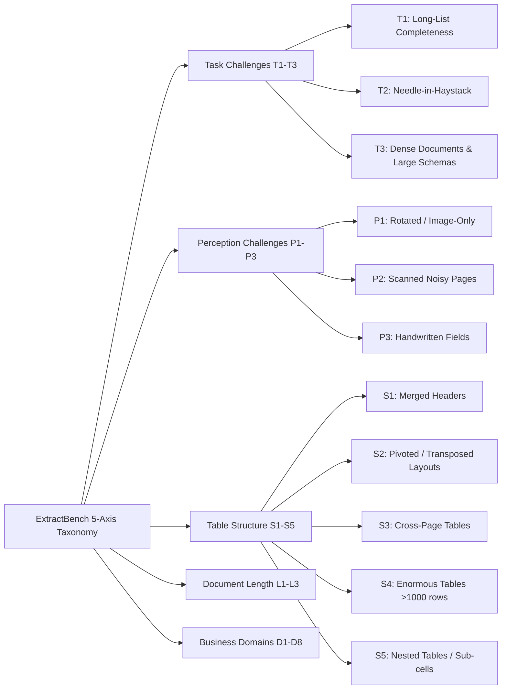

# ExtractBench: Executive Breakdown & Engineering Guide
*A Benchmark for Schema-Guided Enterprise Document Extraction (LlamaIndex, July 2026)*

---

## 1. Executive Summary & Why ExtractBench Matters

ExtractBench is the first comprehensive, enterprise-grade benchmark designed to evaluate **Schema-Guided Document Extraction** at scale across four critical dimensions simultaneously:
1. **Value Accuracy (Order-Insensitive Value F1)**
2. **Completeness on Long Records (Combating list truncation)**
3. **Traceable Source Grounding (Page- and Word-Level Bounding Box IoU $\ge 0.5$)**
4. **Economic Viability (Real measured cost in ¢/page)**

### Key Benchmark Specs
- **Corpus**: 370 enterprise documents (4,869 pages) across **8 business domains** and **67 document types**.
- **Ground Truth Construction**: 3-pronged hybrid methodology:
  - *Real Documents*: Multi-model ensemble agreement + human adjudication on contested cells.
  - *Synthetic Long Lists*: Generated data-first with pixel-accurate layout rendering and exact ground-truth bounding boxes.
  - *Scanned Forms*: Blank-template frozen schemas with human-in-the-loop verification (169 verified documents, 13,867 human-placed boxes).

---

## 2. The 5-Axis Evaluation Taxonomy

ExtractBench categorizes documents along 5 orthogonal axes so failures can be isolated to exact root causes:



### 1. Task Challenges
- **T1: Long-List Completeness (154 docs, 3,710 pages)**: Extracting homogeneous repeating structures (SEC 13F, creditor matrices, clinical logs).
  - *Primary Failure Mode*: Truncation (models stop halfway), duplicated/merged rows.
- **T2: Needle-in-Haystack (39 docs, 1,109 pages)**: High compression ratio (median of 1.6 fields extracted per page from 25+ page contracts/solicitations).
  - *Primary Failure Mode*: Missed mentions, unnormalized paraphrasing.
- **T3: Dense Documents & Massive Schemas (214 docs, 905 pages)**: Labeled boxes, checkboxes, dense forms (tax forms, oil/gas filings). Includes **T3.e** (>150 leaf fields, e.g., Form 1040 bundles with 1,300+ fields).
  - *Primary Failure Mode*: Schema rejection / context blowout, over-extraction (hallucinating values into blank fields).

### 2. Perception & Structural Challenges
- **Perception**: P1 (Rotated/Skewed, 38 docs), P2 (Scanned PDFs, 134 docs), P3 (Handwriting, 55 docs).
- **Table Structures**: S1 (Banded/Hierarchical), S2 (Pivoted/Matrix), S3 (Cross-page splits), S4 (Enormous >1,000 rows), S5 (Table within a cell).
- **Document Length**: L1 Short ($\le 10$ pp, 252 docs), L2 Medium (11–50 pp, 98 docs), L3 Long ($>50$ pp, 20 docs, up to 192 pp).

---

## 3. Benchmark Leaderboard & Key Takeaways

| System Type | Model / Pipeline | Overall Value F1 (%) | L1 Short ($\le 10$pp) | L3 Long ($>50$pp) | Word Grounding F1 (%) | Page Grounding F1 (%) | Mean Cost (¢/page) |
|---|---|:---:|:---:|:---:|:---:|:---:|:---:|
| **Specialized API** | **LlamaExtract Agentic Plus** | **95.6%** | **96.6%** | **94.4%** | **46.4%** | **84.9%** | **8.1 ¢** |
| Specialized API | Reducto Deep Extract | 90.4% | 94.2% | 92.0% | 43.3% | 71.7% | 34.4 ¢ |
| Specialized API | LlamaExtract Agentic | 89.5% | 92.0% | 78.6% | 44.1% | 66.1% | 3.1 ¢ |
| Specialized API | LlamaExtract Cost-Effective | 86.8% | 90.8% | 69.2% | 40.4% | 64.2% | 1.0 ¢ |
| Specialized API | Extend Max Context | 86.3% | 92.0% | 51.3% | 25.1% | 48.9% | 10.0 ¢ |
| Specialized API | Datalab (Accurate + Balanced) | 64.5% | 62.8% | 40.5% | 2.0% | 48.5% | 3.5 ¢ |
| **Coding Agent** | Codex GPT-5.5 | **93.6%** | 95.7% | 78.9% | 0.0% | 0.0% | 27.8 ¢ |
| **Coding Agent** | Claude Code Opus 4.8 | 87.1% | 90.1% | 88.1% | 0.0% | 0.0% | 16.2 ¢ |
| **OSS Models** | Qwen 3.6 35B-A3B | 87.3% | 93.1% | 26.8% | 0.0% | 0.0% | Self-hosted |
| OSS Models | Lift 9B | 77.3% | 87.2% | 25.3% | 0.0% | 0.0% | Self-hosted |
| OSS Models | Gemma4 26B | 66.2% | 80.5% | 12.2% | 0.0% | 0.0% | Self-hosted |
| OSS Models | NuExtract3 | 47.9% | 54.4% | 8.9% | 0.0% | 0.0% | Self-hosted |
| **Commercial VLM**| Gemini 3.5 Flash | 79.8% | 87.9% | 27.9% | 0.0% | 0.0% | 1.0 ¢ |
| Commercial VLM | GPT-5.4 Nano | 74.9% | 77.4% | 35.8% | 0.0% | 0.0% | 0.21 ¢ |

---

## 4. Critical Discoveries & Engineering Insights

### 1. The "Long-Document Collapse" in One-Pass VLMs
- Standard frontier multimodal models (Gemini 3.5 Flash, GPT-5.4 Nano, Qwen 3.6) perform remarkably well on short documents (87–93% F1), but **collapse drastically on long documents ($>50$ pages) down to 12–35% F1**.
- **Root Cause**: Not misreading values, but **recall failure (list truncation)**. When asked to return 500+ records, single-pass generation runs out of output tokens or context attention and silently truncates rows.

### 2. The "Grounding Gap"
- Enterprise compliance requires auditability (knowing exactly where a value came from).
- Direct VLMs and Coding Agents score **0.0% on Grounding F1** because they don't produce standardized bounding-box citation metadata.
- Even the best specialized extraction system (LlamaExtract Agentic Plus) scores **46.4% Word-Level Grounding F1** (vs 84.9% Page-Level Grounding F1). Precise word-level bounding-box attribution remains an industry-wide open frontier.

### 3. Large Schema Rejection ($>150$ Leaf Fields)
- Schemas with hundreds to thousands of fields (like IRS Form 1040 bundles) cause hard failures across 7 evaluated systems (timeouts, context overflow, or prompt constraint rejections).
- Systems that succeed employ hierarchical chunking, multi-pass schema splitting, or specialized sub-agent routers.

### 4. Cost vs. Accuracy Frontier
- Higher cost does not automatically yield higher accuracy:
  - Codex GPT-5.5 costs **27.8 ¢/page** for 93.6% F1.
  - LlamaExtract Agentic Plus achieves **95.6% F1 at 8.1 ¢/page** (less than $1/3$ the cost of coding agents).
  - For high-volume budget workflows, LlamaExtract Cost-Effective (86.8% F1 at 1.0 ¢/page) and Gemini 3.1 Flash Lite offer strong baseline utility.

---

## 5. How to Ingest & Use ExtractBench in Code

### A. Hugging Face Dataset Ingestion
The dataset is hosted at `llamaindex/ExtractBench`:

```python
from datasets import load_dataset

# Load the benchmark metadata and challenge splits
dataset = load_dataset("llamaindex/ExtractBench", split="test")

# Sample document record structure
sample = dataset[0]
doc_id = sample["doc_id"]
domain = sample["domain"]             # e.g., "Finance", "Energy"
challenge_tags = sample["challenge_tags"] # e.g., ["T1.a", "S3", "L2"]
schema = sample["json_schema"]        # Target JSON schema
ground_truth = sample["ground_truth"]  # Normalized target JSON + evidence boxes
```

### B. Benchmark Evaluation Metric Pipeline (Hungarian Matching)
To evaluate your own extraction pipeline against ExtractBench rules:
1. **Canonicalize Dates & Normalization**: ISO `YYYY-MM-DD`, trim & collapse whitespace.
2. **Missing Value Semantics**: Treat missing keys as explicit `null` (penalize hallucinated values in blanks).
3. **Hungarian Algorithm for Array Matching**:
```python
import numpy as np
from scipy.optimize import linear_sum_assignment

def match_extracted_records(expected_records, predicted_records, field_keys):
    """
    Computes optimal 1:1 Hungarian matching between expected and predicted record arrays.
    Cost is the number of mismatched field values.
    """
    n_exp = len(expected_records)
    n_pred = len(predicted_records)
    if n_exp == 0 or n_pred == 0:
        return []

    cost_matrix = np.zeros((n_exp, n_pred))
    for i, exp in enumerate(expected_records):
        for j, pred in enumerate(predicted_records):
            mismatches = sum(1 for k in field_keys if exp.get(k) != pred.get(k))
            cost_matrix[i, j] = mismatches

    row_ind, col_ind = linear_sum_assignment(cost_matrix)
    return list(zip(row_ind, col_ind))
```

---

## 6. Recommended Action Items for Building Enterprise Extractors

1. **Adopt Chunked / Agentic Iteration for Tables**: Do not feed 50+ page documents to a single LLM call expecting complete table recovery. Use page-aware chunking or coding/parsing agents with chunk verification loops.
2. **Implement Dual-Phase Schema Handling**: For schemas $>100$ fields, decompose the schema into logical sub-schemas (e.g. form sections) and route per page.
3. **Preserve Grounding Tokens**: If using OCR + LLM, retain word bounding box coordinates $[x_0, y_0, x_1, y_1, \text{page}]$ throughout the pipeline to produce auditable output.
4. **Benchmark Internal Pipelines Against ExtractBench**: Use the public GitHub test runner to assess truncation rates, scan robustness, and cost per page before deploying document agents to production.
